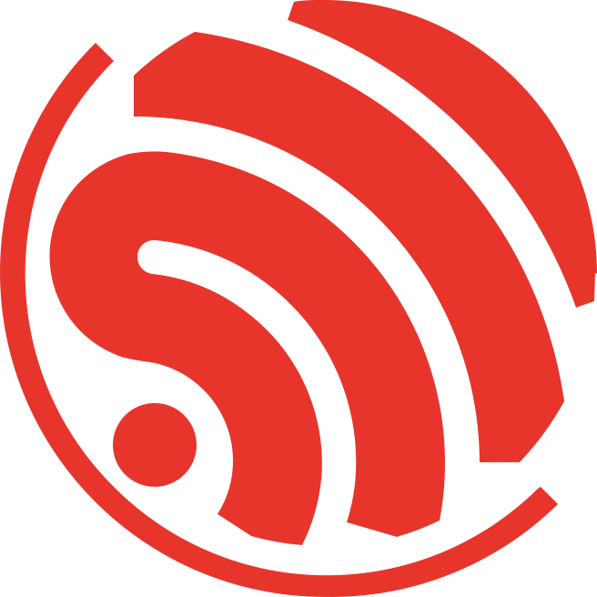
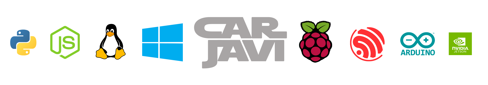

<p align="center"></p>
<h1 align="center"> Espressif Developer </h1> 
<h4 align="right">Ago 26</h4>

<p>
  
</p>

<br>

# Table of contents
- [Table of contents](#table-of-contents)
- [Info](#info)
- [ESP Rainmaker Neo:](#esp-rainmaker-neo)
- [Componentes forman la plataforma](#componentes-forman-la-plataforma)
- [Funciones:](#funciones)

<br>

# Info

Documentación: https://docs.espressif.com/projects/esp-idf/en/latest/esp32/index.html

Developer Portal: https://developer.espressif.com/

IoT Development Framework -esp-idf-: https://github.com/espressif/esp-idf

Espressif MCP Servers: https://mcp.espressif.com/

esp-claw: https://github.com/espressif/esp-claw

<br>

# ESP Rainmaker Neo:

<p align="center"></p>

https://github.com/espressif/esp-rainmaker-neo

https://rainmaker.espressif.com/en

Es una plataforma IoT de código abierto que proporciona una solución integral "dispositivo-nube-aplicación" (device-to-cloud-to-phone) para construir y gestionar productos conectados basados en los chips de Espressif.
Lanzada en agosto de 2026, Neo es una evolución de la plataforma original (ahora llamada ESP RainMaker Classic). Su principal diferencia es que abre por completo el código de la infraestructura en la nube bajo la licencia Apache 2.0, permitiendo a empresas y desarrolladores desplegar todo el sistema dentro de su propia cuenta de Amazon Web Services (AWS) para mantener control total de sus datos y costos.

# Componentes forman la plataforma
RainMaker Neo entrega todo lo necesario para no tener que desarrollar código de servidor ni diseñar apps móviles desde cero:

* ```Backend en la Nube (Cloud Backend)```: Escrito en Go y diseñado bajo una arquitectura Serverless (sin servidores fijos). Se integra con servicios nativos de AWS como AWS IoT Core, Device Shadow y DynamoDB.

* ```SDK de Firmware```: Componentes listos para integrar en el entorno de desarrollo ESP-IDF (mínimo versión v6.0.2) que facilitan la conexión segura de microcontroladores (como el ESP32) a la nube.

* ```Aplicación Móvil de Referencia (ESP RainMaker Home)```: Una app base para iOS y Android desarrollada en React Native y TypeScript. Es completamente personalizable para que las marcas le pongan su propio logotipo y estilo.

* ```Panel de Administración (Admin Dashboard)```: Una interfaz web para monitorizar el estado de los dispositivos en tiempo real, gestionar permisos y controlar las actualizaciones de software.

# Funciones: 
La plataforma automatiza las tareas más complejas de un ecosistema de Internet de las Cosas (IoT):

* ```Aprovisionamiento de Red Sencillo```: Permite configurar las credenciales Wi-Fi del dispositivo mediante la aplicación móvil usando Bluetooth LE (BLE) o escaneando un código QR.

* ```Vinculación de Usuarios```: Realiza de forma segura la asociación entre el dueño del teléfono y el dispositivo físico en el hogar.

* ```Generación Dinámica de UI```: Una de sus características más potentes. Cuando el chip ESP32 se conecta, le dice a la nube qué funciones tiene (por ejemplo, si es una lámpara con brillo y color). La aplicación móvil lee estos parámetros y dibuja los botones e interruptores automáticamente, sin que tengas que programar nada en el teléfono.

* ```Soporte Nativo para Matter```: Es totalmente compatible con el estándar Matter. Puede actuar como un Matter Fabric en la nube, combinando el control local ultrarrápido de Matter con el acceso remoto seguro a través de internet.

* ```Actualizaciones OTA (Over-The-Air)```: Permite enviar de manera remota y masiva nuevas versiones de firmware a grupos específicos de dispositivos para corregir errores o añadir funciones.

* ```Automatizaciones y Agrupamientos```: Facilita la creación de rutinas horarias, esquemas de control centralizado y el agrupamiento de dispositivos por zonas o habitaciones.

* ```Integración con Asistentes de Voz```: Viene lista para conectarse directamente con Alexa de Amazon y Google Assistant


Nota: Al instalar esta plataforma, debes desplegarla dentro de tu propia cuenta de Amazon Web Services (AWS). Por lo tanto, le pagas directamente a AWS por los recursos que consumas:

* ```Costo para hobbistas o prototipos```: Si estás haciendo pruebas o tienes pocos dispositivos, es probable que se mantenga dentro de la capa gratuita de AWS o cueste apenas unos centavos al mes.

* ```Costo comercial```: Si lanzas un producto al mercado, pagarás a Amazon según el tráfico de datos MQTT (AWS IoT Core), las bases de datos (DynamoDB) y las peticiones a la API (AWS Lambda). Al ser una arquitectura Serverless (sin servidores encendidos 24/7), el costo escala proporcionalmente a la cantidad de usuarios activos.


---

<div>
  <p>
     Copyright &nbsp;&copy; 2023 Instinto Digital <a href="https://carjavi.github.io/" title="carjavi.github">carjavi</a>
  </p>
</div>

<p align="center">
    <a href="https://instintodigital.net/" target="_blank"></a>
</p>

